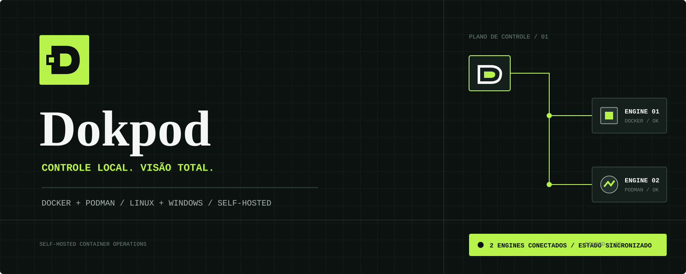
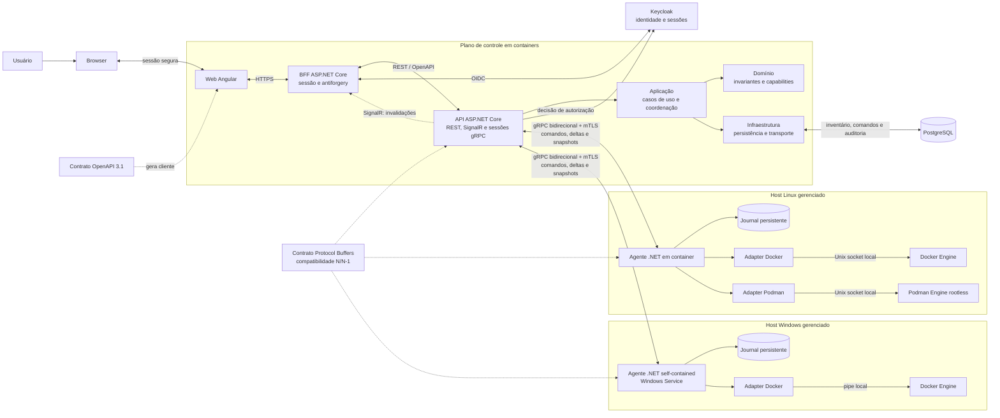

# Dokpod



Dokpod é uma plataforma web self-hosted para descobrir, observar e operar containers Docker e Podman em múltiplos servidores Linux e Windows. Em Linux, cada servidor executa o agente .NET em container. Em Windows, o agente é um Worker Service self-contained, instalado como Windows Service e sem dependência de runtime .NET no host. Em ambos os casos, o agente acessa apenas o engine local e inicia uma conexão autenticada com o plano de controle.

O produto é concorrente e funcionalmente inspirado no Portainer, com arquitetura, contratos, código e identidade próprios.

## Edições e licenciamento

A primeira entrega será o **Dokpod Community Edition**, sem chave ou limites artificiais de nodes e usuários, sob `AGPL-3.0-only`. Uma edição **Dokpod Business** poderá ser oferecida posteriormente por US$ 99/mês ou US$ 990/ano por organização, com governança, automação e suporte comercial para até 100 nodes na matriz inicialmente suportada.

Segurança essencial, autenticação, autorização básica, mTLS, correções de segurança e auditoria mínima permanecem na CE. A Business ainda não está implementada. Consulte a [licença](LICENSE), a [política de licenciamento e comercialização](docs/licenciamento.md) e o [ADR 2026-0003](docs/adr/2026-0003-licenciamento-e-edicoes.md).

## Estado

A arquitetura inicial foi aceita em 2026-09-06. O projeto está em fase de provas técnicas e scaffolding; ainda não há aplicação executável nem promessa de compatibilidade de produção.

## Objetivos do MVP

- cadastrar e aprovar ambientes gerenciados;
- inventariar containers e saúde do engine;
- iniciar, parar, reiniciar e excluir containers;
- suportar Docker em Linux como primeiro alvo;
- validar Podman rootless em Linux e Docker em Windows antes de declará-los estáveis;
- manter auditoria, autorização e comunicação agente-servidor seguras;
- preservar os workloads quando plano de controle ou agente estiver indisponível.

## Não objetivos iniciais

- Kubernetes, Swarm e Nomad;
- criação de containers, stacks e Compose;
- terminal interativo dentro de containers;
- gerenciamento de registries, volumes, redes ou imagens;
- plugins executáveis no servidor ou no agente;
- proxy genérico da API Docker/Podman;
- suporte nativo a Windows containers por Podman.

## Stack definida

- backend, API e agente: C# com .NET 10 LTS;
- frontend: Angular 22 com TypeScript estrito;
- identidade e autorização: Keycloak, com BFF confidencial e API como Policy Enforcement Point;
- contratos: OpenAPI 3.1 para browser/API e Protocol Buffers para agente/API;
- persistência: PostgreSQL;
- observabilidade: OpenTelemetry, logs estruturados, métricas e health checks;
- distribuição: backend, BFF e frontend sempre em containers; agente Linux em container; agente Windows como Worker Service self-contained.
- toolchains e bases OCI: imagens versionadas do projeto [`lzocateli/containers`](https://github.com/lzocateli/containers), conforme a [matriz de distribuição](docs/distribuicao.md#imagens-base-e-toolchains).

## Arquitetura resumida



O inventário persistido é uma projeção reconstruível. O engine local é a fonte de verdade do estado dos containers. O servidor envia comandos de domínio versionados; o agente não expõe um proxy irrestrito do socket.

## Estrutura alvo

```text
backend/
  apps/api/                  # plano de controle HTTP, gRPC e SignalR
  apps/bff/                  # sessão OIDC confidencial e proteção de tokens
  apps/agent/                # host comum do agente Linux/Windows
  libs/domain/               # invariantes compartilhadas sem infraestrutura
  libs/control-plane/        # aplicação e infraestrutura do plano de controle
  libs/agent/                # aplicação e infraestrutura do agente
  tests/
frontend/
  web/                       # aplicação Angular 22
  libs/                      # bibliotecas frontend reutilizáveis
  tests/
contracts/
  openapi/                   # API pública do plano de controle
  agent/                     # protocolo versionado agente-servidor
deploy/                      # imagens, pacote Windows, Keycloak, Compose e operação
docs/
  adr/                       # decisões arquiteturais
  plan/                      # planos verificáveis
tools/scripts/               # automação global de infraestrutura e manutenção
```

## Documentação

- [Viabilidade técnica](docs/viabilidade.md)
- [Arquitetura](docs/arquitetura.md)
- [Backend e agente](docs/backend.md)
- [Frontend](docs/frontend.md)
- [Segurança](docs/seguranca.md)
- [Configuração do Keycloak](docs/configuracao-keycloak.md)
- [Distribuição e operação](docs/distribuicao.md)
- [Licenciamento e comercialização](docs/licenciamento.md)
- [Scripts e automação](.github/SCRIPTING.md)
- [ADR da arquitetura inicial](docs/adr/2026-0001-arquitetura-inicial.md)
- [ADR de distribuição e identidade](docs/adr/2026-0002-distribuicao-e-identidade.md)
- [ADR de licenciamento e edições](docs/adr/2026-0003-licenciamento-e-edicoes.md)
- [Plano proposto do MVP](docs/plan/mvp.md)
- [Guia de contribuição](.github/CONTRIBUTING.md)

## Princípios

1. O plano de controle nunca acessa diretamente o socket de um host remoto.
2. A comunicação do agente parte do host gerenciado e usa identidade por ambiente.
3. Keycloak é a autoridade externa de identidade e autorização; o Dokpod não mantém senhas nem políticas próprias.
4. Operações mutáveis são autorizadas, auditáveis, deduplicadas e reconciliáveis.
5. Docker e Podman são capacidades distintas sob um contrato comum, não engines presumidos como idênticos.
6. Secrets, conteúdo de logs de containers e credenciais nunca entram em telemetria por padrão.
7. Dependências externas exigem licença permissiva, manutenção ativa e versão fixada.

## Próxima etapa

Executar as provas técnicas descritas no [parecer de viabilidade](docs/viabilidade.md#provas-técnicas-obrigatórias) e iniciar o scaffolding conforme a arquitetura aceita. Docker Linux, Podman Linux e Docker Windows só recebem suporte publicado após seus respectivos gates.
