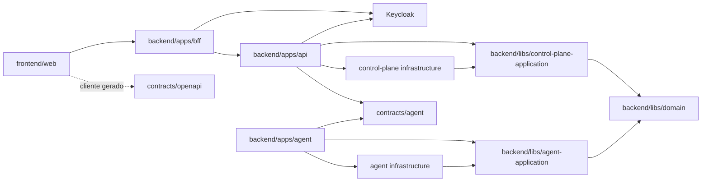

# Arquitetura do Dokpod

## Contexto

O Dokpod separa o plano de controle dos hosts que executam containers. O plano de controle mantém inventário projetado, comandos e auditoria; o Keycloak mantém identidades e decisões de autorização. Cada agente traduz comandos de domínio para a API local Docker ou Podman.

## Componentes

| Componente | Responsabilidade | Não deve fazer |
| --- | --- | --- |
| Web | experiência administrativa Angular | acessar engine, banco ou protocolo do agente |
| BFF | cliente OIDC confidencial, sessão do browser, antiforgery e relay de tokens | decidir autorização ou expor tokens ao browser |
| API | validar tokens, aplicar decisões do Keycloak, contratos HTTP e sessão de agentes | manter usuários/políticas ou conter adapter específico de engine |
| Keycloak | usuários, credenciais, MFA, sessões, grupos, roles, recursos, scopes e políticas | executar regras de domínio ou identificar agentes |
| Aplicação | casos de uso, idempotência e coordenação | depender de ASP.NET Core ou EF Core |
| Domínio | ambientes, capacidades, comandos e invariantes | depender de infraestrutura |
| Infraestrutura | PostgreSQL, engine clients, certificados e transporte | expor modelos internos como DTO público |
| Agente | inventário, execução local e reporte | decidir autorização do usuário final sozinho |

## Dependências permitidas

Hosts são composition roots. Regras reutilizáveis pertencem às bibliotecas. Contratos não dependem de aplicações.

## Implantação por plataforma

- Web Angular, BFF e API são sempre construídos e executados como containers.
- PostgreSQL e Keycloak são serviços externos obrigatórios ao plano de controle, normalmente executados por containers com dados e backups independentes.
- Em Linux, o agente é sempre uma imagem OCI e acessa o Unix socket explicitamente montado.
- Em Windows, o agente é publicado como Worker Service self-contained por RID suportado e instalado como Windows Service. O host não precisa de runtime .NET.
- O pacote Windows inclui executável, dependências, configuração não secreta, manifesto de versão e procedimento de instalação/remoção. Chaves, certificados e journal ficam fora do diretório do binário, em armazenamento persistente protegido por ACL.
- O mesmo contrato e os mesmos casos de uso do agente valem nas duas distribuições; integração com lifecycle, filesystem, socket/pipe e atualização pertence ao adapter de plataforma.
- Builds, testes e runtimes seguem a matriz versionada em [Distribuição e operação](distribuicao.md#imagens-base-e-toolchains).

## Modelo de domínio inicial

- **Ambiente:** host ou contexto de engine aprovado, com identidade e capacidades.
- **Agente:** instância instalada, versão, plataforma e estado de conexão.
- **Engine:** Docker ou Podman, versão de API, modo rootful/rootless e capacidades.
- **Container observado:** projeção do identificador imutável, nome, imagem e estado.
- **Comando:** intenção mutável com ID idempotente, alvo, prazo e solicitante.
- **Execução:** aceite, início, conclusão, erro técnico e revisão observada.
- **Snapshot:** visão versionada e reconstruível do engine.
- **Evento de auditoria:** registro append-only da intenção e do resultado.

## Fluxo de inventário

1. O agente abre um único stream gRPC bidirecional HTTP/2 com mTLS; o servidor deriva o ambiente do certificado, concede uma única sessão ativa e anuncia o fencing token.
2. A primeira mensagem do agente negocia versão N/N-1, engine, plataforma, arquitetura e capabilities. Versão incompatível encerra o stream sem degradar autorização.
3. O agente observa eventos do engine e envia deltas como caminho normal. Heartbeat padrão ocorre a cada 15 segundos com jitter de 20% e não gera histórico individual no PostgreSQL.
4. Cada mensagem carrega versão, sessão, fencing token, sequência monotônica, timestamp e correlation ID. A API rejeita geração antiga, lacuna não reconciliada, payload acima do limite e capability desconhecida.
5. Snapshot completo ocorre no primeiro vínculo, após lacuna/reconexão solicitada pelo servidor e periodicamente a cada 15 minutos com jitter. Snapshots são paginados em lotes limitados, aplicados transacionalmente por revisão e substituem somente a projeção do ambiente correspondente.
6. A API consolida mudanças e publica pelo SignalR somente invalidação segmentada por ambiente, limitada inicialmente a uma emissão por segundo. O browser busca o estado durável pela API.

O contrato v1 terá um serviço de sessão com uma operação bidirecional `Connect`. Servidor envia controle de sessão, solicitação de snapshot e comandos; agente envia apresentação, heartbeat, deltas, partes de snapshot, aceite e resultado. Inscrição inicial e emissão do primeiro certificado usam endpoint HTTPS separado, de uso único e sem conexão anônima ao stream operacional.

## Fluxo de comando

1. O BFF mantém os tokens fora do browser e envia à API um token destinado ao recurso Dokpod.
2. A API valida assinatura, issuer, audience e expiração, solicita/aplica a decisão do Keycloak para a ação e ambiente e falha fechada.
3. A aplicação persiste o comando antes do envio.
4. O agente valida identidade, sessão, fencing token, prazo, capacidade e duplicidade contra journal persistente.
5. O adapter executa a operação no engine local com timeout e cancelamento.
6. O agente persiste e reporta resultado, hash do comando e estado observado.
7. A aplicação conclui ou reconcilia a execução e grava auditoria.

Não existe garantia distribuída de exactly-once. O desenho usa entrega at-least-once, deduplicação e reconciliação.

## Compatibilidade

- Contratos do browser usam versão explícita e evolução expand-contract.
- O protocolo do agente informa versão mínima/máxima e capabilities.
- Servidor N suporta agentes N e N-1; cada release publica a matriz e a data de fim da versão anterior.
- Campos protobuf preservam números, não reutilizam tags removidas e aceitam campos desconhecidos quando seguros; comandos e enums desconhecidos são rejeitados.
- Migrations seguem expand-contract: servidor anterior continua funcional durante rollback até a etapa destrutiva, executada somente após a janela N-1.
- Operações comuns usam uma porta de engine; extensões Docker e Libpod ficam em adapters separados.

## Escala inicial

O baseline de capacidade é 56 agentes, aproximadamente 1.120 containers e 30 usuários simultâneos. O teste de margem antes da release usa pelo menos 100 agentes, 2.000 containers e 50 usuários, incluindo reconexão simultânea, inventário degradado e comandos concorrentes em ambientes distintos.

O monólito modular é suficiente para essa carga. O MVP inicia com uma instância de API contendo endpoints HTTP, hub SignalR, scheduler de comandos e sessões gRPC; BFF e web permanecem processos separados. PostgreSQL fornece coordenação durável, e memória local é apenas cache efêmero. Métricas de container não são armazenadas como série temporal ilimitada no banco transacional.

Escala horizontal da API não faz parte da primeira release. Quando disponibilidade ou medidas exigirem múltiplas réplicas, um ADR deve definir ownership temporário de conexões por lease, fencing e roteamento durável de comandos até a réplica dona do stream.

Não adicionar broker, cache distribuído ou microsserviço antes de métricas demonstrarem a necessidade e um ADR definir operação e recuperação.

## Decisões adiadas

- matriz de Windows Server, RID, conta de serviço e versões de Docker suportadas;
- limites de retenção para inventário e auditoria;
- estratégia de atualização segura do agente;
- suporte futuro a criação declarativa, Compose e stacks.

Esses itens não alteram a arquitetura aceita. Cada capability permanece desabilitada até cumprir seu gate, e mudanças de protocolo incompatíveis ou escala horizontal exigem ADR próprio.