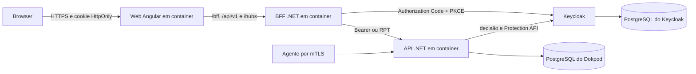

# Configuração do Keycloak para o Dokpod

## Estado

Este documento define o contrato de identidade e autorização do Dokpod. Os manifests e valores exatos serão criados durante o scaffolding e validados em laboratório antes de produção.

Keycloak é uma dependência externa obrigatória. O baseline containerizado usa `lzocateli/keycloak:26.7.0`, fixada também por digest em cada release. O Dokpod não possui fallback de usuário local nem modo que ignore autorização quando o Keycloak estiver indisponível.

## Topologia

| Componente | Responsabilidade |
| --- | --- |
| Keycloak | usuários, credenciais, MFA, federação, SSO, sessões, grupos, roles, recursos, scopes e políticas |
| BFF | login, callback, logout, cookie técnico, antiforgery e tokens no servidor |
| API | validar token e aplicar a decisão do Keycloak antes de acessar domínio ou projeção |
| Angular | interface sem acesso a access token ou refresh token |
| Agente | identidade técnica própria por certificado mTLS; não participa do login OIDC |

Keycloak e Dokpod usam bancos, roles, credenciais, backups e ciclos de vida separados. O banco do Dokpod não replica usuários, memberships ou políticas.

## Realm e clients

Nunca use o realm `master` para a aplicação. O baseline usa:

| Item | Nome recomendado | Finalidade |
| --- | --- | --- |
| Realm | `dokpod` | domínio de identidade da instalação |
| Client confidencial | `dokpod-bff` | Authorization Code + PKCE e logout |
| Resource server | `dokpod-api` | audience, recursos, scopes e políticas |
| Client de serviço | `dokpod-provisioner` | registrar e reconciliar recursos com menor privilégio |
| Audience | `dokpod-api` | destinatário obrigatório do token da API |

O client `dokpod-bff` habilita somente redirects e post-logout redirects exatos da origem implantada. Wildcards amplos, Direct Access Grants, Implicit Flow e Offline Access permanecem desabilitados sem ADR específico.

O secret do BFF e a credencial do provisioner vêm de secret montado ou provider seguro. Não entram em Git, imagem, Compose versionado, argumentos de processo ou logs.

## Recursos e scopes

Cada ambiente aprovado é registrado como recurso independente, por identificador opaco, por exemplo `urn:dokpod:environment:{id}`. Nome do host, endereço e engine não fazem parte do identificador de autorização.

Scopes iniciais:

| Scope | Permissão |
| --- | --- |
| `environment:read` | listar e consultar ambiente e containers autorizados |
| `container:start` | iniciar container |
| `container:stop` | parar container |
| `container:restart` | reiniciar container |
| `container:delete` | excluir container sem remover volumes implicitamente |
| `audit:read` | consultar auditoria do ambiente |
| `environment:manage` | aprovar, suspender e configurar o ambiente |

Roles podem agrupar permissões para administração, operação e auditoria, mas a decisão final continua associada ao recurso e scope. O Dokpod não persiste cópia de role ou membership como autorização local.

## Fluxo do browser

1. O browser solicita login ao BFF.
2. O BFF inicia Authorization Code com PKCE no Keycloak.
3. O callback é validado com state, nonce, issuer e redirect URI exatos.
4. O BFF mantém tokens no servidor e emite somente cookie de sessão protegido.
5. O BFF encaminha à API token com audience `dokpod-api` ou RPT adequado.
6. A API valida assinatura, issuer, audience, expiração e permissões.
7. Logout encerra a sessão local e propaga logout ao Keycloak.

Cookies usam `Secure`, `HttpOnly`, path mínimo e `SameSite` compatível com o fluxo. Operações mutáveis exigem antiforgery; CORS e Origin permitem somente a origem canônica configurada.

## Aplicação da autorização

A API autoriza antes de revelar existência, nome, estado ou metadado de ambiente/container. O fluxo recomendado é:

1. obter candidatos sem serializar a resposta;
2. solicitar/aplicar decisão do Keycloak por recurso e scope;
3. omitir decisões negativas em coleções e retornar `403` em recurso direto;
4. retornar `503 application/problem+json` se uma decisão necessária estiver indisponível;
5. nunca retornar página parcial que revele diferença de autorização;
6. registrar somente IDs técnicos, scope, resultado e correlation ID.

A integração de recursos usa upsert idempotente, detecta divergência e remove ou desabilita o recurso quando o ambiente é removido conforme política de retenção. Credenciais administrativas globais do realm são proibidas no runtime.

## Agentes

Agentes não usam login de usuário, client credentials do BFF nem token de acesso do Keycloak. Cada agente possui certificado cliente individual vinculado ao ambiente. A API combina duas fronteiras distintas:

- usuário: token e decisão do Keycloak para criar a intenção;
- agente: mTLS, sessão cercada por fencing e capability para executar a intenção.

Nenhum token de usuário é encaminhado ao agente.

## Baseline de segurança

- conta administrativa nominativa, MFA e remoção da credencial temporária de bootstrap;
- brute-force detection e rate limit no proxy;
- access tokens curtos e sessões com limites explícitos;
- TLS válido e issuer canônico único;
- rotação de secrets dos clients e backup testado do banco do Keycloak;
- logs sem token, cookie, authorization code, secret ou dados pessoais desnecessários;
- imagem Keycloak fixada por versão e digest, com licença, SBOM e vulnerabilidades verificadas;
- realm exportado sem usuários, credenciais ou secrets.

## Validação mínima

- discovery retorna o issuer esperado do realm `dokpod`;
- login, callback, renovação e logout funcionam sem token no browser;
- token com issuer, audience, assinatura ou expiração inválidos é rejeitado;
- usuário autorizado no ambiente A não enumera, observa SignalR, audita ou opera B;
- decisão negativa não revela o recurso;
- indisponibilidade e revogação no Keycloak falham fechadas;
- provisionamento repetido converge sem duplicar recursos;
- agente válido sem autorização de usuário não cria comando por conta própria.

## Operação

O deployment deve incluir health/readiness do Keycloak sem transformar indisponibilidade em bypass. Backups do banco do Keycloak e do banco do Dokpod são independentes e ambos precisam de testes de restauração. Atualizações seguem release notes, compatibilidade, migration, rollback, scan de vulnerabilidades e teste dos fluxos autenticados.

Valores de sessão, tokens e URLs serão fixados com evidência do ambiente de implantação. Atualizações da imagem seguem a matriz e os gates definidos em [Distribuição e operação](distribuicao.md#imagens-base-e-toolchains).