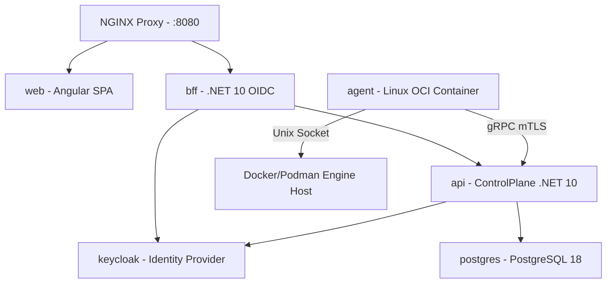

# Plano: Padronização de Dockerfiles Multi-Stage e Docker Compose Dev/Prod

**Status:** approved  
**Data de criação:** 2026-09-11  
**Última atualização:** 2026-09-11  
**Responsáveis:** Lincoln Zocateli  
**Origem:** IA assistida  
**Revisor humano:** Lincoln Zocateli  
**Relacionado:** ADR 2026-0001, ADR 2026-0002 e [docs/distribuicao.md](../distribuicao.md)

## Objetivo

Garantir a unicidade, paridade e coerência da stack do Dokpod entre o ambiente de desenvolvimento local e o deploy definitivo/produção, reutilizando os mesmos Dockerfiles multi-stage para a aplicação `web`, `bff`, `api` e `agent`, além de fornecer um Docker Compose completo para orquestração da stack em desenvolvimento.

## Contexto e premissas

- O Dokpod opera totalmente containerizado (web, bff, api, agente Linux, postgresql e keycloak), à exceção do agente Windows (serviço nativo).
- O ambiente de desenvolvimento deve refletir com fidelidade as restrições e imagens do ambiente de produção (dev-prod parity), utilizando como base as imagens homologadas em `lzocateli/containers`.
- Para evitar duplicação de regras de build e manter uma fonte única de verdade (Single Source of Truth), os Dockerfiles serão estruturados como **multi-stage builds**, fornecendo targets reutilizáveis tanto para desenvolvimento quanto para o runtime final de produção.
- O browser nunca se comunica diretamente com a API do plano de controle: a SPA Angular conversa com o BFF, que realiza o relay para a API e interage com o Keycloak para autenticação OIDC confidencial.

## Estrutura dos Dockerfiles Multi-Stage

Cada aplicação terá seu Dockerfile proprietário, estruturado em estágios declarativos:

### 1. Frontend Web Angular (`frontend/web/Dockerfile`)
- **Estágio `deps` / `build-base`**: Baseado em `lzocateli/angular-cli:22.1.0-node24.15.0-bookworm`. Copia manifests de pacotes e executa `npm ci`.
- **Target `development` (`dev`)**: Utilizado no Compose de dev quando necessário desenvolvimento com live-reload (`ng serve`) ou servidor de desenvolvimento containerizado.
- **Estágio `build-prod`**: Executa a compilação otimizada de produção (`npm run build -- --configuration production`).
- **Target `production` (`runtime`)**: Imagem final minimalista baseada em `lzocateli/nginx:1.28.0-bookworm`. Copia somente os assets compilados do Angular e a configuração NGINX customizada, rodando como usuário não-root `nginx`.

### 2. Backend-For-Frontend (`backend/apps/Dokpod.Bff/Dockerfile`)
- **Estágio `build`**: Baseado em `lzocateli/dotnet-sdk:10.0.400-noble`. Restaura dependências e compila os projetos da solução necessários ao BFF.
- **Target `development` (`dev`)**: Permite execução containerizada em dev com suporte a `dotnet watch` e logs detalhados.
- **Estágio `publish`**: Executa `dotnet publish --configuration Release --no-restore`.
- **Target `production` (`runtime`)**: Imagem final minimalista baseada em `lzocateli/dotnet-aspnet:10.0.11-noble`. Executa como `$APP_UID` não-root, sem SDK ou ferramentas de compilação, com rotas de healthcheck e portas não privilegiadas.

### 3. ControlPlane API (`backend/apps/Dokpod.ControlPlane.Api/Dockerfile`)
- **Estágio `build`**: Baseado em `lzocateli/dotnet-sdk:10.0.400-noble`. Restaura contratos gRPC/Protobuf e bibliotecas de domínio/aplicação/infraestrutura.
- **Target `development` (`dev`)**: Permite rodar a API em dev com ambiente `Development`, portas de debug/gRPC habilitadas.
- **Estágio `publish`**: Executa `dotnet publish --configuration Release`.
- **Target `production` (`runtime`)**: Imagem final minimalista baseada em `lzocateli/dotnet-aspnet:10.0.11-noble`, executando como não-root `$APP_UID`, expondo portas gRPC mTLS (7443) e HTTP/Health (8080).

### 4. Agente Linux (`deploy/agent/Dockerfile` ou `backend/apps/Dokpod.Agent/Dockerfile`)
- **Estágio `build`**: Compila o Worker de agente com `lzocateli/dotnet-sdk:10.0.400-noble`.
- **Target `production` (`runtime`)**: Imagem OCI final baseada em `lzocateli/dotnet-aspnet:10.0.11-noble`, configurada com o volume persistente `/var/lib/dokpod-agent` para certificados/journal e acesso ao Unix socket local do Docker/Podman (`/run/docker.sock`).

---

## Orquestração com Docker Compose de Desenvolvimento

Será criado o arquivo de orquestração `deploy/dev/docker-compose.yaml` (ou `docker-compose.dev.yml` na raiz) para subir a stack completa do Dokpod em desenvolvimento com um único comando.

### Serviços da Stack Dev:

1. **`postgres`**:
   - Imagem: `lzocateli/postgresql:18.4-pgvector0.8.6-bookworm`
   - Armazena os dados transacionais do Dokpod (schema `dokpod`).
2. **`keycloak`**:
   - Imagem: `lzocateli/keycloak:26.7.0`
   - Serviço de identidade com importação automática do realm `dokpod-realm.json`.
3. **`api`**:
   - Build do `backend/apps/Dokpod.ControlPlane.Api/Dockerfile` (target `dev` ou `runtime`).
   - Depende de `postgres` e `keycloak`.
4. **`bff`**:
   - Build do `backend/apps/Dokpod.Bff/Dockerfile` (target `dev` ou `runtime`).
   - Depende de `api` e `keycloak`.
5. **`web`**:
   - Build do `frontend/web/Dockerfile` (target `dev` ou `runtime`).
   - Servidor estático ou dev server para o Angular.
6. **`proxy`**:
   - Reverse Proxy NGINX centralizando as rotas da aplicação no dev:
     - `/` -> `web`
     - `/bff` -> `bff`
     - `/api` -> `api`
7. **`agent`**:
   - Build do `deploy/agent/Dockerfile`.
   - Executa em container OCI montando `/var/run/docker.sock` do host para inspeção e controle de containers locais.

---

## Garantias de Segurança e Coerência

1. **Dev-Prod Parity**: Todas as imagens de desenvolvimento e produção utilizam as mesmas imagens base `lzocateli/*`, eliminando problemas do tipo "funciona na minha máquina".
2. **Sem Secrets em Código ou Imagens**: Secrets e senhas de dev usam arquivos externos (armazenados em `$env:APPDATA\Microsoft\UserSecrets\Dokpod\.env`) e são injetados exclusivamente no runtime do Compose.
3. **Rede Restrita**: Apenas a porta do proxy público (ex: 8080) é mapeada para o host. Serviços internos (`api`, `bff`, `postgres`, `keycloak`) comunicam-se pela rede interna do Compose (`dokpod-dev-net`).
4. **Isolamento não-root**: Todas as imagens finais de produção rodam como usuário sem privilégios (`nginx` ou `$APP_UID`).

## Etapas do Plano

1. **P04-01**: Criar `backend/apps/Dokpod.Bff/Dockerfile` estruturado com multi-stage build.
2. **P04-02**: Atualizar os Dockerfiles existentes (`web`, `api`, `agent`) para padronizar as etapas multi-stage (`build`, `dev`, `publish`, `runtime`).
3. **P04-03**: Criar o arquivo `deploy/dev/docker-compose.yaml` integrando toda a stack (`postgres`, `keycloak`, `api`, `bff`, `web`, `proxy`, `agent`).
4. **P04-04**: Validar o startup da stack em desenvolvimento, verificando conectividade mTLS do agente, login OIDC via BFF e saúde dos serviços.
