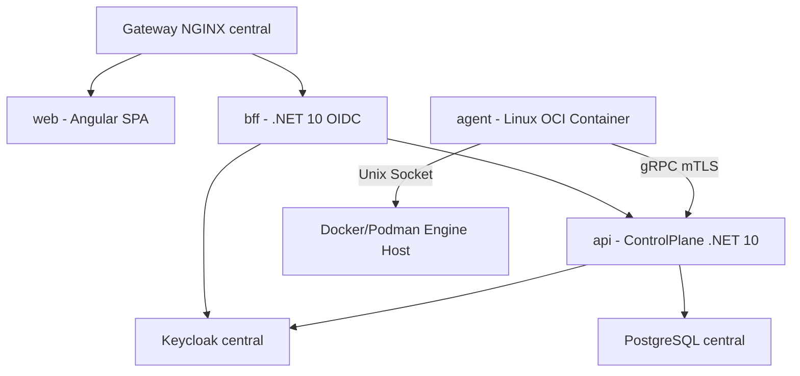

# Plano: Padronização de Dockerfiles Multi-Stage e Docker Compose Dev/Prod

**Status:** approved  
**Data de criação:** 2026-09-11  
**Última atualização:** 2026-09-15
**Responsáveis:** Lincoln Zocateli  
**Origem:** IA assistida  
**Revisor humano:** Lincoln Zocateli  
**Relacionado:** ADR 2026-0001, ADR 2026-0002 e [docs/distribuicao.md](../distribuicao.md)

## Objetivo

Garantir a unicidade, paridade e coerência da stack do Dokpod entre o ambiente de desenvolvimento local e o deploy definitivo/produção, reutilizando os mesmos Dockerfiles multi-stage para a aplicação `web`, `bff`, `api` e `agent`, além de fornecer um Docker Compose completo para orquestração da stack em desenvolvimento.

## Contexto e premissas

- O Dokpod opera totalmente containerizado (web, bff, api, agente Linux, postgresql e keycloak), à exceção do agente Windows (serviço nativo).
- O ambiente de desenvolvimento deve refletir com fidelidade as restrições e imagens do ambiente de produção (dev-prod parity), utilizando como base as imagens homologadas em `lzocateli/containers`.
- Para evitar duplicação de regras de build e manter uma fonte única de verdade (Single Source of Truth), os Dockerfiles serão estruturados como **multi-stage builds**, fornecendo targets reutilizáveis tanto para desenvolvimento quanto para o runtime final de produção.
- O browser nunca se comunica diretamente com a API do plano de controle: a SPA Angular conversa com o BFF, que realiza o relay para a API e interage com o Keycloak para autenticação OIDC confidencial.
- O avanço atual do BFF já implementou a sessão server-side, a autenticação OIDC e a rota de login/logout do browser; a próxima etapa funcional é o relay autenticado para `GET/POST/PUT/DELETE/PATCH` na API, além do ponto de entrada WebSocket/SignalR sob o mesmo guard.
- A dependência funcional restante é a existência de endpoints HTTP versionados da API (`/api/v1`) e do hub SignalR (`/hubs`) que o BFF possa encaminhar sem expor tokens ao browser.
- A implementação posterior do BFF deve seguir o plano dedicado [P05 - BFF, Keycloak e relay seguro do browser](p05-bff-keycloak-relay.md), que define o contrato, as invariantes de não exposição de tokens, os testes e os gates de release.

## Estrutura dos Dockerfiles Multi-Stage

Cada aplicação terá seu Dockerfile proprietário, estruturado em estágios declarativos:

### 1. Frontend Web Angular (`frontend/web/Dockerfile`)
- **Estágio `deps` / `build-base`**: Baseado em `lzocateli/angular-cli:22.1.0-node24.15.0-bookworm`. Copia manifests de pacotes e executa `npm ci`.
- **Target `development` (`dev`)**: Utilizado no Compose de dev quando necessário desenvolvimento com live-reload (`ng serve`) ou servidor de desenvolvimento containerizado.
- **Estágio `build-prod`**: Executa a compilação otimizada de produção (`npm run build -- --configuration production`).
- **Target `production` (`runtime`)**: Imagem final minimalista baseada em `lzocateli/nginx:1.28.0-bookworm`. Copia somente os assets compilados do Angular e a configuração NGINX customizada, rodando como usuário não-root `nginx`.

### 2. Backend-For-Frontend (`backend/apps/Dokpod.Bff/Dockerfile`)
- **Estágio `build`**: Baseado em `lzocateli/dotnet-sdk:10.0.400-noble`. Restaura dependências e compila os projetos da solução necessários ao BFF.
- **Target `development` (`dev`)**: Permite execução containerizada em dev com suporte a `dotnet watch` e logs detalhados.
- **Estágio `publish`**: Executa `dotnet publish --configuration Release --no-restore`.
- **Target `production` (`runtime`)**: Imagem final minimalista baseada em `lzocateli/dotnet-aspnet:10.0.11-noble`. Executa como `$APP_UID` não-root, sem SDK ou ferramentas de compilação, com rotas de healthcheck e portas não privilegiadas.

### 3. ControlPlane API (`backend/apps/Dokpod.ControlPlane.Api/Dockerfile`)
- **Estágio `build`**: Baseado em `lzocateli/dotnet-sdk:10.0.400-noble`. Restaura contratos gRPC/Protobuf e bibliotecas de domínio/aplicação/infraestrutura.
- **Target `development` (`dev`)**: Permite rodar a API em dev com ambiente `Development`, portas de debug/gRPC habilitadas.
- **Estágio `publish`**: Executa `dotnet publish --configuration Release`.
- **Target `production` (`runtime`)**: Imagem final minimalista baseada em `lzocateli/dotnet-aspnet:10.0.11-noble`, executando como não-root `$APP_UID`, expondo portas gRPC mTLS (7443) e HTTP/Health (8080).

### 4. Agente Linux (`deploy/agent/Dockerfile` ou `backend/apps/Dokpod.Agent/Dockerfile`)
- **Estágio `build`**: Compila o Worker de agente com `lzocateli/dotnet-sdk:10.0.400-noble`.
- **Target `production` (`runtime`)**: Imagem OCI final baseada em `lzocateli/dotnet-aspnet:10.0.11-noble`, configurada com o volume persistente `/var/lib/dokpod-agent` para certificados/journal e acesso ao Unix socket local do Docker/Podman (`/run/docker.sock`).

---

## Orquestração com Docker Compose de Desenvolvimento

O Compose canônico da aplicação é `deploy/e2e/docker-compose-dokpod.yaml`. Ele sobe somente os serviços do Dokpod e reutiliza a plataforma central de identidade e gateway pela rede externa `identity-global`.

### Serviços da Stack Dev:

1. **`api`**:
   - Build do `backend/apps/Dokpod.ControlPlane.Api/Dockerfile` (target `dev` ou `runtime`).
   - Conecta-se ao PostgreSQL e ao Keycloak centrais, sem subir cópias locais.
2. **`bff`**:
   - Build do `backend/apps/Dokpod.Bff/Dockerfile` (target `dev` ou `runtime`).
   - Usa o client OIDC central `dokpod-bff` e a rede `identity-global`.
3. **`web`**:
   - Build do `frontend/web/Dockerfile` (target `dev` ou `runtime`).
   - Servidor estático ou dev server para o Angular.
4. **`agent`**:
   - Build do `deploy/agent/Dockerfile`.
   - Executa em container OCI montando `/var/run/docker.sock` do host para inspeção e controle de containers locais.

---

## Garantias de Segurança e Coerência

1. **Dev-Prod Parity**: Todas as imagens de desenvolvimento e produção utilizam as mesmas imagens base `lzocateli/*`, eliminando problemas do tipo "funciona na minha máquina".
2. **Sem Secrets em Código ou Imagens**: Secrets e senhas de dev usam arquivos externos (armazenados em `$env:APPDATA\Microsoft\UserSecrets\Dokpod\.env`) e são injetados exclusivamente no runtime do Compose.
3. **Rede Restrita**: O Compose do Dokpod não sobe proxy, PostgreSQL ou Keycloak próprios. A aplicação conecta-se à rede externa `identity-global`, publicada pelo gateway central, e reaproveita a infraestrutura compartilhada.
4. **Isolamento não-root**: Todas as imagens finais de produção rodam como usuário sem privilégios (`nginx` ou `$APP_UID`). O acesso ao socket permanece restrito ao perfil explícito do agente em laboratório.

## Etapas do Plano

1. **P04-01**: Criar `backend/apps/Dokpod.Bff/Dockerfile` estruturado com multi-stage build.
2. **P04-02**: Atualizar os Dockerfiles existentes (`web`, `api`, `agent`) para padronizar as etapas multi-stage (`build`, `dev`, `publish`, `runtime`).
3. **P04-03**: Reaproveitar `deploy/e2e/docker-compose-dokpod.yaml` como Compose da aplicação, integrando apenas `web`, `bff`, `api` e o agente opcional à rede externa `identity-global`; NGINX, Keycloak e PostgreSQL permanecem na plataforma central.
4. **P04-04**: Validar o startup da stack em desenvolvimento, verificando conectividade mTLS do agente, login OIDC via BFF e saúde dos serviços.
5. **P04-05**: Implementar o relay autenticado do BFF para a API (`/api/v1/{**path}`) e para o hub SignalR/WebSocket (`/hubs/{**path}`), incluindo envio do access token da sessão, headers permitidos e proteção de Origin/CSRF.
6. **P04-06**: Integrar a SPA Angular ao BFF para obter sessão, iniciar login/logout, carregar o antiforgery e explodir apenas as rotas do backend através do proxy do BFF.
7. **P04-07**: Validar a integração real ponta a ponta com Keycloak e API pública, cobrindo falhas de token expirado, autorização horizontal, erro 401/403, indisponibilidade do downstream e reinício de sessão.

O detalhamento funcional e de segurança dessas etapas está no plano [P05 - BFF, Keycloak e relay seguro do browser](p05-bff-keycloak-relay.md). Este plano P04 permanece responsável pela paridade de imagens, Compose, NGINX e operação da stack.

## Evidências atuais

- Os Dockerfiles de web, BFF, API e agente possuem targets `dev`, `publish` e `runtime`; o runtime copia somente artefatos publicados e mantém execução não-root quando suportada.
- O Dockerfile do agente copia os contratos protobuf durante restore/build, evitando dependência acidental do checkout completo no build limpo.
- `docker build` passou para `dokpod/agent:dev`, `dokpod/api:dev`, `dokpod/bff:dev` e `dokpod/web:dev` em Docker Desktop Linux.
- O smoke test do agente passou com filesystem read-only, tmpfs restrito, grupo suplementar para o socket Docker e `DOKPOD_AGENT_RUN_ONCE=true`; o agente negociou a API 1.47 e atualizou o inventário local.
- `docker compose -f deploy/e2e/docker-compose-dokpod.yaml config --quiet` é o gate de configuração da aplicação; a stack usa a rede externa `identity-global` e não cria NGINX, Keycloak ou PostgreSQL duplicados.
- A stack canônica `dokpod` foi validada em execução com `web`, `bff` e `api` saudáveis, conectada à plataforma `altivy-identity`; o agente continua opcional e privilegiado somente no perfil de laboratório.
- A tentativa anterior de `dokpod-dev` foi encerrada e seus arquivos de Compose/proxy removidos para evitar duas plataformas de identidade concorrentes.
- O teste amplo `dotnet test Dokpod.slnx` não fecha neste ambiente: 30 testes passaram, 4 foram ignorados e 11 falharam por certificado HTTPS de desenvolvimento/authority Keycloak ausente e permissão de artefato gerado no volume Windows; essas falhas não pertencem às alterações do P04.

## Pendências

- Executar `up --wait` em ambiente de laboratório com secrets e certificado externos, sem versionar ou exibir esses valores.
- Validar health/readiness, persistência após recriação, login OIDC pelo BFF, relay REST/SignalR e conexão real do agente.
- Executar revisão de segurança e código do diff antes de alterar o status do plano ou promover a stack para uso publicado.
- O perfil `agent` monta o socket Docker e equivale a privilégio administrativo do host; permanece restrito a laboratório isolado até existir adapter/socket rootless e revisão de segurança específica.
