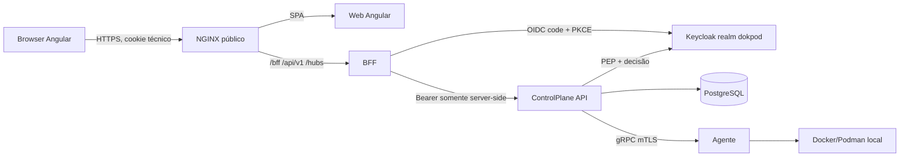

# Plano: BFF, Keycloak e relay seguro do browser

**Status:** approved  
**Data de criação:** 2026-09-13  
**Última atualização:** 2026-09-13  
**Responsáveis:** Lincoln Zocateli  
**Origem:** IA assistida  
**Revisor humano:** Lincoln Zocateli  
**Relacionado:** [ADR 2026-0001](../adr/2026-0001-arquitetura-inicial.md), [ADR 2026-0002](../adr/2026-0002-distribuicao-e-identidade.md), [docs/bff.md](../bff.md), [docs/seguranca.md], [P04 - Dockerfiles e Compose](p04-padronizacao-dockerfiles-compose.md)

## Objetivo

Entregar o BFF do Dokpod como a única fronteira HTTP do browser, completando o caminho Angular -> BFF -> API sem expor access tokens, refresh tokens, client secrets ou credenciais de Keycloak ao frontend, ao Web Storage, às URLs ou aos logs.

O resultado esperado é um fluxo funcional de login, sessão, logout, chamadas REST e eventos SignalR/WebSocket em que:

- o browser conhece somente o estado sanitizado da sessão;
- o BFF mantém tokens e client secret exclusivamente no servidor;
- a API continua sendo o Policy Enforcement Point (PEP) e valida autorização;
- a API pública possui contratos versionados em `/api/v1` e hubs sob `/hubs`;
- falhas de autenticação, autorização, downstream e Keycloak são observáveis e falham fechadas;
- a stack Compose/NGINX não oferece uma rota alternativa que permita ao browser contornar o BFF.

## Estado atual e hipótese de trabalho

A fundação de autenticação do BFF já existe em `backend/apps/Dokpod.Bff`: Authorization Code com PKCE, cookie server-side, ticket store, refresh coordenado, antiforgery, validação de Origin, rate limit de login e Data Protection persistente. O frontend consulta `/bff/session` e inicia login por `/bff/login`.

A hipótese verificável deste plano é: **o risco residual principal não está no armazenamento de tokens no browser, mas na ausência de um relay downstream completo e da superfície HTTP pública da API**. A hipótese será refutada se os testes provarem que o browser consegue executar as operações reais através de `/api/v1` e `/hubs`, sem receber credenciais ou cookies do downstream.

## Comparação de referência

A implementação equivalente no AltivyNotes foi usada apenas como referência de comportamento e estrutura:

- `Relay/BffProxyRouteBuilderExtensions`: relay REST versionado, query string preservada e erros downstream normalizados;
- `Relay/BffHubsProxyRouteBuilderExtensions`: negotiate, long polling/SSE quando suportados e upgrade WebSocket;
- `Relay/BearerTokenRelayHandler` e `ServerAccessTokenProvider`: token obtido no contexto server-side e inserido somente na chamada downstream;
- `Relay/ProxyHeaders`: remoção centralizada de headers hop-by-hop, `Authorization` e headers de transporte;
- testes de Origin, relay, sessão e refresh;
- validação E2E por proxy HTTPS com Keycloak real.

O Dokpod deve preservar as garantias, mas usar seus próprios contratos, nomes, opções e módulos.

## Decisão de sequenciamento do SignalR/WebSocket

SignalR/WebSocket é uma implementação importante para a experiência operacional do Dokpod, mas não é requisito para concluir o primeiro fluxo funcional do BFF. Login, sessão, logout, inventário inicial e comandos do MVP podem operar sobre REST, com polling controlado enquanto o hub ainda não estiver disponível.

O relay do hub deve ser executado no momento adequado: depois que a API REST versionada, a autorização por ambiente e o contrato de eventos estiverem estáveis. A implementação não deve ser criada apenas para preencher a rota `/hubs`; ela precisa de um hub real na API, eventos autorizados e testes de upgrade, encerramento e reconexão.

O objetivo do hub é reduzir polling e latência para eventos como reconexão de agente, alteração de inventário, mudança de estado de comando, fencing e reconciliação. Ele não substitui o REST como fonte durável do estado: o browser recebe uma invalidação/evento mínimo e consulta o recurso autorizado pela API.

Sequência obrigatória:

1. concluir API REST e relay REST do BFF;
2. usar polling limitado como fallback operacional do frontend;
3. definir eventos, grupos por ambiente e autorização do hub;
4. implementar P05-04 com relay SignalR/WebSocket server-side;
5. habilitar o hub no frontend somente após testes E2E de Origin, token, reconexão e ausência de credenciais no browser.

## Fronteiras e responsabilidades

### Browser e SPA Angular

- chamar somente rotas públicas do BFF e recursos relativos sob `/api/v1` e `/hubs` encaminhados pelo BFF;
- usar cookies automaticamente, sem ler o cookie de sessão;
- obter sessão apenas de `/bff/session`;
- obter token antiforgery de `/bff/antiforgery` e enviá-lo no header configurado em mutações e logout;
- iniciar login por navegação para `/bff/login`;
- nunca ler, armazenar, copiar, decodificar ou enviar access/refresh tokens;
- nunca usar `localStorage`, `sessionStorage`, URL fragment, query string ou variável pública para credenciais.

### BFF

- ser cliente OIDC confidencial do realm `dokpod`;
- manter access token, refresh token e expiração em ticket server-side;
- renovar tokens sem registrar seus valores;
- aplicar autenticação, autorização de sessão, antiforgery, Origin, rate limit e limites de transporte;
- encaminhar somente rotas permitidas e headers permitidos;
- inserir o Bearer apenas na requisição entre BFF e API;
- remover `Authorization`, `Cookie`, `Set-Cookie` e headers hop-by-hop do trânsito inadequado;
- retornar 401/403/502/504 sem redirecionar chamadas AJAX para login;
- nunca decidir permissões de ambiente ou container no lugar da API.

### API

- expor REST versionado e hub SignalR/WebSocket;
- validar issuer, audience, assinatura, expiração, claims e decisão de autorização;
- aplicar autorização horizontal por ambiente e ação antes de revelar ou alterar dados;
- manter contratos em `contracts/openapi` e eventos/hubs versionados;
- não confiar em headers fornecidos pelo browser como identidade ou autorização;
- continuar sem acesso direto às engines: operações passam pelo agente autenticado por mTLS.

### Keycloak e deployment

- Keycloak mantém usuários, credenciais, MFA, sessões, roles, recursos, scopes e políticas;
- secrets entram por provider seguro ou arquivo externo montado em runtime;
- NGINX expõe somente o entrypoint público aprovado;
- API, BFF, banco e Keycloak não são publicados diretamente no host em produção;
- headers forwarded somente de proxies e redes confiáveis.

## Não escopo

- implementar identidade local, cadastro, senha, recuperação, membership ou política de autorização no Dokpod;
- entregar autorização no BFF em substituição à API;
- expor proxy genérico do Docker/Podman ou aceitar URL/método bruto do browser para engine;
- persistir access ou refresh tokens no PostgreSQL, frontend ou logs;
- habilitar escala horizontal do BFF sem decisão sobre ticket store, Data Protection, refresh coordination e rate limit compartilhados;
- criar realm, usuário, client secret ou export real de Keycloak no Git.

## Arquitetura alvo

## Contrato de rotas

| Rota | Método | Acesso | Requisito |
| --- | --- | --- | --- |
| `/bff/login` | GET | anônimo, rate limited | `returnUrl` somente local |
| `/bff/session` | GET | anônimo | projeção sem tokens ou claims desnecessários |
| `/bff/antiforgery` | GET | autenticado | retorna somente request token para o browser |
| `/bff/logout` | POST | autenticado | Origin + antiforgery; encerra cookie e sessão OIDC |
| `/api/v1/{**path}` | HTTP permitido | autenticado | relay REST server-side |
| `/hubs/{**path}` | GET/POST/upgrade | autenticado | relay SignalR/WebSocket server-side |
| `/health/live` | GET | anônimo | sem dependência externa |
| `/health/ready` | GET | anônimo | discovery Keycloak e dependências necessárias |

O contrato final deve definir métodos aceitos, limites de corpo, timeout, tamanho de resposta, política de query string, headers permitidos e semântica de erro. Rotas não listadas não devem ser criadas por conveniência.

## Invariantes de segurança

### Proibição de credenciais no browser

- nenhuma resposta do BFF contém `access_token`, `refresh_token`, `id_token`, `client_secret` ou equivalente;
- nenhum token aparece em HTML, JavaScript, source map, cookie legível, URL, query, fragment, header exposto, erro ou log;
- o cookie de sessão é `HttpOnly`, `Secure`, `SameSite` explícito, host-only e não contém o ticket quando o store server-side estiver ativo;
- o downstream não pode definir cookie no browser através de `Set-Cookie` encaminhado pelo BFF;
- o frontend não usa Web Storage para autenticação;
- o frontend não configura `Authorization: Bearer` manualmente.

### CSRF e Origin

- mutações HTTP exigem antiforgery e Origin permitida, conforme a política adotada para chamadas same-origin;
- logout exige antiforgery;
- upgrade WebSocket valida Origin apesar de usar GET;
- `Origin` e `Referer` do browser nunca são tratados como identidade;
- requisições sem Origin não são aceitas automaticamente em operações que exigem prova de origem, salvo exceção documentada para clientes não-browser autenticados por outro mecanismo.

### Relay e headers

- `Authorization`, `Cookie`, `Set-Cookie`, `Host`, `Connection`, `Upgrade`, `Transfer-Encoding`, `Content-Length`, `TE`, `Trailer`, `Proxy-*` e outros hop-by-hop são tratados por allowlist/denylist explícita;
- o Authorization downstream é sempre substituído pelo token obtido no ticket server-side;
- query string e caminho são reconstruídos a partir de valores roteados, sem aceitar URL absoluta ou SSRF;
- respostas 3xx do downstream não redirecionam o browser para destino arbitrário;
- erros de conexão viram 502/504 sem detalhes sensíveis;
- limites de timeout, corpo, resposta e concorrência são aplicados.

### Sessão e escala

- Data Protection usa key ring persistente e certificado fora de Development;
- ticket store server-side tem expiração, revogação e proteção contra leitura indevida;
- refresh concorrente é coordenado por sessão/token;
- antes de múltiplas réplicas, um ADR define store compartilhado, fencing da renovação, rate limit distribuído e invalidação de sessão;
- a memória local permanece apenas uma decisão explícita para laboratório/instância única.

## Etapas

### P05-01: contrato de confiança, threat model e decisões pendentes

**Status:** in-progress  
**Dependências:** ADR 2026-0001 e ADR 2026-0002

Entregas:

- revisar ADR 2026-0002 para refletir o BFF Dokpod, relay e SignalR;
- registrar threat model para XSS, CSRF, token leakage, confused deputy, SSRF, header smuggling, redirect abuse, WebSocket hijacking e indisponibilidade do Keycloak;
- definir audience, scopes, callback, post-logout redirect, TTL de access/refresh token e política de revogação;
- decidir formalmente o limite de suporte: uma instância ou escala horizontal;
- definir limites operacionais do relay.

Validação:

- cada ameaça possui controle, teste negativo e sinal operacional;
- não há fallback de autorização local;
- o revisor humano aprova o contrato antes do código.

Registro: aprovação humana recebida em 2026-09-13 para prosseguir com a implementação; as validações técnicas e a evidência de testes permanecem pendentes.

### P05-02: fechar a fundação de autenticação server-side

**Status:** in-progress  
**Dependências:** P05-01

Escopo existente a verificar e completar:

- Authorization Code + PKCE e backchannel sem redirects;
- cookie `__Host-Dokpod.Session` e `ServerSideTicketStore`;
- refresh coordenado e rejeição da sessão quando refresh falhar;
- antiforgery, Origin, forwarded headers e rate limit;
- Data Protection persistente e certificado obrigatório fora de Development;
- redaction de logs e ausência de tokens em exceções/telemetria.

Validação:

- testes de opções OIDC/cookie, refresh concorrente, sessão expirada, refresh inválido e Keycloak indisponível;
- teste de que `/bff/session` nunca serializa tokens;
- teste de cookie sem ticket legível no browser;
- teste de configuração insegura falhar no startup.

### P05-03: implementar relay REST seguro

**Status:** in-progress  
**Dependências:** P05-02 e contratos HTTP da API

Entregas:

- separar o relay REST em componente próprio, preservando query string e rota versionada;
- obter access token exclusivamente do contexto server-side;
- inserir Bearer somente na requisição BFF -> API;
- centralizar cópia de headers com allowlist e exclusão de hop-by-hop, `Authorization`, cookies e headers de proxy;
- não encaminhar `Set-Cookie` do downstream;
- normalizar 401, 403, 502, 504 e cancelamento;
- aplicar timeout, limite de corpo/resposta e cancelamento por `RequestAborted`;
- impedir base URL inválida, URL absoluta no path, path traversal lógico e redirect aberto;
- cobrir HEAD/OPTIONS apenas se a API e o contrato exigirem.

Validação:

- teste com handler downstream capturando headers prova Bearer server-side;
- teste prova que Authorization/Cookie do browser são descartados;
- teste prova que resposta com Set-Cookie não cria cookie no browser;
- testes de query string, corpo, content type, 401/403, timeout, 502 e 504;
- teste negativo de SSRF e URL absoluta.

Evidência parcial em 2026-09-13:

- `dotnet test backend/tests/Dokpod.Bff.Tests/Dokpod.Bff.Tests.csproj --configuration Release --no-restore -p:DisableFastUpToDateCheck=true --verbosity minimal` aprovado com 20 testes;
- `DownstreamProxyTests` prova que o Bearer da sessão substitui o Authorization do browser, cookies de entrada não são encaminhados, `Set-Cookie` do downstream não retorna ao browser e a query string é preservada;
- `DownstreamProxyTests` também prova respostas 401/403 sem redirect, 502 para indisponibilidade, 504 para timeout, rejeição de traversal e URI absoluta, descarte de `Location` externo, allowlist de headers e limites de corpos conhecidos e chunked; mutações REST exigem validação antiforgery por filtro de endpoint;
- a configuração do destino usa uma única fonte `Downstream:Api`, com esquema seguro e timeout aplicado também à leitura do corpo;
- `DownstreamApiOptionsValidatorTests` cobre HTTPS fora de Development, loopback HTTP somente em Development, query/fragment e limites positivos;
- política operacional de egress para destinos privados, SignalR/WebSocket e integração com a API pública permanecem pendentes.

Arquivos prováveis:

- `backend/apps/Dokpod.Bff/Relay/BffProxyRouteBuilderExtensions.cs`;
- `backend/apps/Dokpod.Bff/Relay/ProxyHeaders.cs`;
- `backend/apps/Dokpod.Bff/Relay/ServerAccessTokenProvider.cs`;
- `backend/apps/Dokpod.Bff/Relay/BearerTokenRelayHandler.cs`;
- testes em `backend/tests/Dokpod.Bff.Tests/Relay`.

### P05-04: implementar relay SignalR/WebSocket seguro

**Status:** in-progress  
**Dependências:** P05-03 e hub público da API

Esta etapa é importante e planejada, mas não bloqueia o primeiro MVP REST. Deve iniciar somente após P05-05 disponibilizar um hub real e o contrato de eventos estar aprovado.

Implementação inicial em 2026-09-13: o BFF e a API já possuem relay/hub `control-plane`, e o frontend possui cliente same-origin com reconexão. A autorização horizontal por ambiente, o contrato de eventos e a validação E2E permanecem pendentes.

Evidência focada em 2026-09-13: `dotnet test backend/tests/Dokpod.ControlPlane.Api.Tests/Dokpod.ControlPlane.Api.Tests.csproj --configuration Release --no-restore --filter FullyQualifiedName~ControlPlaneHttpSurfaceTests --verbosity minimal` aprovado com 3 testes, cobrindo rotas protegidas, grupo estável e rejeição de identificador inválido.

Entregas:

- suportar negotiate e transporte HTTP previsto pelo cliente;
- suportar upgrade WebSocket com token inserido somente no socket BFF -> API;
- preservar subprotocols permitidos e encerrar corretamente ambas as direções;
- validar Origin antes do upgrade;
- não aceitar token em query string salvo decisão explícita e mitigação documentada;
- normalizar falha de conexão para 502/504 sem vazar detalhes;
- limitar tamanho de mensagem, duração e cancelamento.

Validação:

- teste de Origin permitido e negado;
- teste de handshake e subprotocol;
- teste de fechamento pelo browser, pela API e por cancelamento;
- teste de token expirado/rejeitado no hub;
- teste de que o browser nunca recebe o Bearer usado no socket downstream.

Critério de não bloqueio: enquanto a autorização horizontal, o contrato de eventos e a validação E2E não estiverem concluídos, o frontend deve permanecer funcional usando REST e polling limitado, sem apontar diretamente para a API e sem introduzir token no browser.

### P05-05: entregar superfície HTTP pública da API

**Status:** in-progress  
**Dependências:** P05-01 e contratos existentes

Entregas:

- criar endpoints REST versionados sob `/api/v1` para sessão de usuário, ambientes, inventário, comandos e auditoria conforme o MVP;
- criar hub SignalR sob `/hubs` para invalidações segmentadas, sem transmitir conteúdo não autorizado;
- configurar autenticação JWT Bearer destinada ao audience da API;
- aplicar autorização por recurso/ambiente e ação antes da consulta ou mutação;
- retornar `application/problem+json`, correlation ID e status consistente;
- manter API sem rota pública alternativa para o browser no deployment padrão;
- atualizar OpenAPI e contratos gerados.

Implementação inicial em 2026-09-13: a API possui JWT Bearer configurado, `GET /api/v1/session` e `ControlPlaneHub` em `/hubs/control-plane`. Inventário, comandos, ProblemDetails e autorização por ambiente ainda não foram entregues.
Bloqueio técnico: `IEnvironmentAuthorizationDecider` e `EnvironmentAccessService` já existem na camada de aplicação e possuem testes, mas ainda não há adapter Keycloak registrado no host da API. O hub não deve liberar grupos por claims genéricas ou allowlist local; a decisão externa precisa ser implementada e injetada antes da liberação operacional.
`EnvironmentAccessServiceTests` aprovado com 9 testes.

Implementação em 2026-09-13: `KeycloakAuthorizationDecisionService` consulta UMA no endpoint de token do realm, usando `audience`, `resource#scope` e o access token server-side; respostas de transporte, timeout ou JSON inválido falham fechadas como `Indeterminate`. O serviço foi registrado no host da API e o hub consulta `urn:dokpod:environment:{id}` com `environment:read` antes de adicionar a conexão ao grupo.

`KeycloakAuthorizationDecisionServiceTests` e `KeycloakAuthorizationOptionsTests` aprovados; a suíte focada do recorte passou com 20 testes, cobrindo concessão UMA, negação HTTP, indisponibilidade do Keycloak, validação de authority/audience/timeout, resource/scope inválidos, hub e aplicação.

O validator está ligado a `ValidateOnStart`, a `Authority` efetiva vem de `IOptions<KeycloakAuthorizationOptions>` validada e o timeout aceito fica entre 1 e 30 segundos. O adapter não registra bearer nem aceita resource/scope fora do contrato. A API deve manter ator e token derivados do mesmo principal em qualquer novo chamador.

Foi criado `tools/scripts/test-keycloak-authorization-spike.ps1`, inspirado no script equivalente do AltivyNotes. Ele valida uma decisão UMA real contra o realm `dokpod`, aceita token efêmero por `SecureString` ou variável de processo, oferece `--help`/`-DryRun`, não lê arquivos de secrets e produz apenas resultado, status e latência. A execução real depende de recurso UMA provisionado, token de usuário válido e ambiente Keycloak autorizado; não foi executada nesta sessão.

Foi criado também `tools/scripts/provision-environment-authorization.ps1`, inspirado em `provision-vault-owner-authorization.ps1` do AltivyNotes. Ele cria ou reutiliza o recurso `urn:dokpod:environment:{id}`, policy de usuário/grupo e permission para um scope, de forma idempotente. O `DryRun` foi validado; a execução real requer credencial administrativa externa.

O adapter UMA é a ponte entre a porta `IEnvironmentAuthorizationDecider` da aplicação e o Keycloak Authorization Services. Ele existe para que cada operação seja decidida por recurso e scope, evitando confiar apenas em autenticação, role genérica ou claims copiadas localmente. O BFF mantém o token fora do browser; a API usa o token server-side para pedir a decisão; o domínio recebe apenas o resultado permitido/negado/indeterminado.

Validação:

- issuer, audience, assinatura, expiração, scope e recurso inválidos são rejeitados;
- usuário sem ambiente recebe 403 e não recebe metadados do ambiente;
- acesso horizontal, comando fora da capacidade e auditoria sem permissão são negados;
- Keycloak indisponível durante decisão falha fechada;
- testes usam PostgreSQL/Keycloak reais quando a evidência depender de persistência/autorização.

### P05-06: integrar Angular exclusivamente ao BFF

**Status:** in-progress  
**Dependências:** P05-03, P05-04 e contratos da API

Entregas:

- criar serviço de sessão para `/bff/session`, login e logout;
- carregar antiforgery antes de mutações e anexar header apenas às chamadas necessárias;
- configurar cliente HTTP relativo para `/api/v1` e cliente SignalR para `/hubs` sem token explícito;
- remover qualquer uso de `localStorage`, `sessionStorage`, `Authorization`, fragment token e query token;
- tratar 401 sem redirecionar silenciosamente operações API; oferecer navegação controlada ao login;
- exibir somente claims mínimos retornados pelo BFF;
- garantir que erros não mostrem headers, respostas de token ou segredos.

Implementação inicial em 2026-09-13: `@microsoft/signalr` foi restaurado com sucesso e `ControlPlaneRealtimeService` usa somente `/hubs/control-plane` com `withCredentials`, sem `accessTokenFactory`.

Evidências adicionais em 2026-09-13:

- `npm install` em `frontend/web` concluiu `up to date`, auditou 390 pacotes e encontrou 0 vulnerabilidades;
- `dotnet build backend/apps/Dokpod.ControlPlane.Api/Dokpod.ControlPlane.Api.csproj --configuration Release --no-restore --verbosity minimal` aprovado;
- `ng test --watch=false` aprovado com 1 teste;
- a primeira tentativa de `ng build --configuration production` gerou o bundle, mas falhou ao remover `dist/dokpod-web/3rdpartylicenses.txt` por `EACCES` no volume montado; a compilação TypeScript/Angular foi concluída antes da falha de ownership;
- a suíte completa da API foi executada, mas 8 testes de `TransportBoundaryTests` falharam no handshake SSL/mTLS dos agentes (`unexpected EOF`/`Unavailable`); 4 testes PostgreSQL foram ignorados por `DOKPOD_TEST_POSTGRES_CONNECTION` ausente. Esse bloqueio pertence ao transporte de agentes e não valida nem invalida a nova superfície HTTP/SignalR.

Validação:

- busca textual/AST bloqueia APIs de Web Storage e headers Bearer no frontend;
- testes Angular provam sessão anônima, autenticada, indisponível, 401, logout e antiforgery;
- teste de rede confirma somente `/bff/*`, `/api/v1/*` e `/hubs/*` relativos;
- Playwright confirma ausência de token em cookies acessíveis, localStorage, sessionStorage, URL e DOM.

### P05-07: integrar Compose, NGINX e secrets

**Status:** not-started  
**Dependências:** P05-03 a P05-06

Entregas:

- fazer NGINX encaminhar `/` para web e `/bff`, `/api/v1`, `/hubs` somente para o BFF;
- impedir exposição direta de API, BFF, PostgreSQL e Keycloak no host de produção;
- configurar WebSocket e headers forwarded de forma restrita;
- injetar client secret, certificado de Data Protection e credenciais somente por secret provider/mount externo;
- garantir que Dockerfile, Compose, logs e artefatos não contenham secrets;
- persistir o key ring e dados necessários com permissões mínimas.

Validação:

- scan de secrets e inspeção do bundle/artefatos;
- teste de rota direta para API rejeitada ou inacessível a partir do browser;
- teste de login, relay REST, hub, logout e health checks pela URL pública;
- inspeção de labels, usuários, mounts, portas e redes.

### P05-08: validação E2E e operação

**Status:** not-started  
**Dependências:** P05-07

Cenários obrigatórios:

- sessão anônima e login real via Keycloak;
- callback inválido, state/nonce inválido e returnUrl absoluto;
- token próximo da expiração e refresh concorrente;
- refresh rejeitado e sessão invalidada;
- 401, 403 e autorização horizontal;
- CSRF e Origin ausente/não permitido;
- REST com corpo, query, erro downstream e timeout;
- negotiate, WebSocket, encerramento e reconexão;
- logout local e no Keycloak;
- reinício do BFF, persistência do key ring e comportamento do ticket store;
- Keycloak/API indisponível e recuperação;
- tentativa de acesso direto do browser à API;
- inspeção de DevTools, HAR, cookies, Web Storage, URL, DOM, logs e traces para garantir ausência de tokens/secrets.

Evidências mínimas:

- `dotnet test` focado do BFF e da API;
- testes de integração com Keycloak/API reais quando aplicável;
- Playwright em navegador real;
- build das imagens e smoke test da stack;
- relatório de scan de secrets, dependências e imagens;
- matriz de resultados com teste, comando, data, ambiente e evidência.

### P05-09: documentação, release gate e escala futura

**Status:** not-started  
**Dependências:** P05-08

Entregas:

- atualizar `docs/bff.md` somente com comportamentos comprovados;
- atualizar `docs/backend.md`, `docs/arquitetura.md`, `docs/seguranca.md` e contratos quando necessário;
- documentar configuração sanitizada do Keycloak, callbacks, origins, secrets externos e troubleshooting;
- registrar limitações da instância única e critérios para habilitar réplicas;
- criar ADR específico se a escala horizontal exigir storage compartilhado, rate limit distribuído ou mudança de fronteira;
- bloquear release se houver token no frontend, segredo em artefato, achado alto/crítico sem tratamento ou teste obrigatório ausente.

## Matriz de arquivos e responsabilidades

| Área | Local provável | Resultado |
| --- | --- | --- |
| BFF auth | `backend/apps/Dokpod.Bff/Authentication` | sessão, refresh, Origin, antiforgery, Data Protection |
| BFF relay | `backend/apps/Dokpod.Bff/Relay` | REST, hub, headers, token server-side |
| BFF testes | `backend/tests/Dokpod.Bff.Tests` | composição, segurança, relay, sessão |
| API host | `backend/apps/Dokpod.ControlPlane.Api` | JWT, endpoints, hub, health |
| Contratos | `contracts/openapi` e contratos de eventos | API pública versionada |
| Frontend | `frontend/web/src/app` | sessão, antiforgery, API relativa, hub sem token |
| E2E | `frontend/tests` e `deploy/e2e` | navegador real e stack pública |
| Deployment | `deploy/nginx`, Compose e secrets externos | única entrada pública e runtime seguro |
| Documentação | `docs/bff.md`, `docs/backend.md`, `docs/seguranca.md` | comportamento comprovado |

## Critérios de aceite finais

O plano somente poderá ser marcado como concluído após evidência humana referenciada de que:

- o browser executa login, logout, REST e hub somente através do BFF;
- nenhum access/refresh/id token ou secret aparece no frontend, Web Storage, URL, DOM, cookies acessíveis, HAR, logs ou traces;
- o BFF injeta o Bearer apenas no salto server-side para a API;
- a API valida token e autorização horizontal antes de revelar dados;
- CSRF, Origin, redirect, SSRF, header smuggling e WebSocket hijacking possuem testes negativos aprovados;
- API/Keycloak/BFF não são expostos diretamente pelo deployment padrão;
- o fluxo de refresh, revogação, logout e indisponibilidade foi testado;
- os contratos, OpenAPI, documentação, imagens e runbooks refletem o comportamento entregue;
- decisões de escala horizontal e armazenamento de sessão estão explícitas antes de qualquer réplica.

## Riscos e decisões adiadas

- A sessão local em memória e o rate limit local não suportam múltiplas réplicas sem ADR e infraestrutura compartilhada.
- O relay WebSocket pode exigir limites e estratégia de backpressure específicos; não liberar produção sem teste de encerramento e carga mínima.
- A autorização por ambiente depende do contrato Keycloak/API; o BFF não deve duplicar essa política.
- O uso de query string para token em clientes SignalR deve ser evitado; qualquer exceção precisa de decisão documentada e redaction comprovada.
- A validação final depende de Keycloak, API HTTP e Compose funcionais; testes apenas de composição não comprovam ausência de leakage em navegador real.
