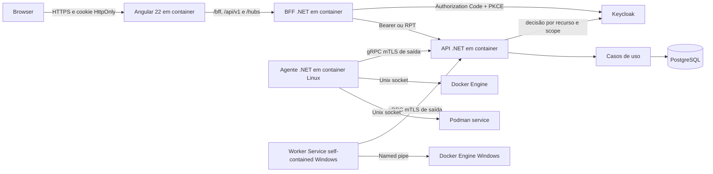

# Viabilidade técnica do Dokpod

**Status:** arquitetura aceita; implementação condicionada às provas técnicas
**Data:** 2026-09-06
**Escopo:** plano de controle containerizado, agente Linux em container e agente Windows self-contained para Docker e Podman

O Dokpod é tecnicamente viável com backend, BFF, API e agente em C#/.NET 10 e frontend em Angular 22. O .NET 10 é uma versão LTS ativa até novembro de 2028 e oferece os recursos necessários para HTTP, HTTP/2, gRPC, TLS mútuo, criptografia, serviços em segundo plano, observabilidade, concorrência assíncrona, containers Linux e Worker Services self-contained no Windows.

A linguagem não é o principal risco. Os riscos determinantes são o nível de privilégio necessário para acessar os engines, a diferença operacional entre Docker e Podman, o transporte seguro entre agentes e plano de controle e o ciclo de instalação, atualização e proteção do Worker Service no Windows. Este documento reúne a arquitetura, os riscos e as provas técnicas obrigatórias exigidas pelo [ADR 2026-0001](adr/2026-0001-arquitetura-inicial.md) e usadas como critério de validação pelo [plano do MVP](plan/mvp.md).

## Problema e proposta

O Dokpod será uma plataforma self-hosted para inventariar e operar containers em múltiplos servidores. O plano de controle deverá permitir, inicialmente:

- registrar, aprovar, suspender e remover ambientes;
- descobrir containers e estado do engine;
- iniciar, parar, reiniciar e excluir containers;
- apresentar eventos, saúde e última sincronização;
- auditar comandos e resultados sem registrar secrets;
- operar Docker em Linux e Windows e Podman em Linux; Podman no Windows é tratado como engine Linux dentro da VM até validação específica.

O produto é inspirado no problema resolvido pelo Portainer e em seus conceitos de ambientes, agentes e snapshots, mas terá contratos, implementação, identidade visual e experiência próprias. Nenhum código do Portainer deve ser copiado.

## Adequação da stack

### C# e .NET 10

O .NET atende aos requisitos centrais:

| Capacidade | Recurso recomendado | Avaliação |
| --- | --- | --- |
| API administrativa | ASP.NET Core com OpenAPI | maduro e adequado |
| Canal agente-servidor | gRPC bidirecional sobre HTTP/2 e mTLS | adequado; validar proxies e timeouts |
| Atualizações da interface | SignalR | adequado para notificações, não para estado durável |
| Acesso Docker/Podman | `HttpClient` sobre Unix socket ou named pipe | viável; requer adapters e testes por SO |
| Jobs concorrentes | `BackgroundService`, channels limitados e cancelamento | adequado |
| Criptografia e certificados | TLS, X.509 e APIs criptográficas da plataforma | adequado |
| Observabilidade | OpenTelemetry, logs estruturados e health checks | adequado |
| Persistência | PostgreSQL com EF Core | adequado para inventário, comandos e auditoria |
| Plano de controle | containers Linux para web, BFF e API | adequado e reproduzível |
| Agente Linux | imagem OCI .NET | adequado para Docker e Podman locais |
| Agente Windows | Worker Service self-contained | viável sem runtime instalado; exige matriz de RID, ACL e serviço |
| Identidade e autorização | Keycloak, OIDC e Authorization Services | adequado; exige BFF e fail-closed na API |

Não é necessário usar Go para consumir a Docker Engine API: ela é HTTP REST versionada e pode ser acessada por qualquer cliente HTTP. O Podman oferece uma API compatível com Docker v1.40 e uma API Libpod nativa. O adapter deve negociar capacidades em vez de assumir equivalência completa entre engines.

### Angular 22

Angular 22 é adequado para um console operacional com tabelas extensas, filtros, logs em streaming e ações protegidas. Recomenda-se aplicação standalone, TypeScript estrito, Signals para estado local, RxJS nas bordas assíncronas, cliente gerado por OpenAPI e Playwright para fluxos críticos.

## Arquitetura inicial recomendada

O agente inicia a conexão para o plano de controle. Esse modelo funciona melhor atrás de NAT e firewall, evita expor o socket do engine na rede e permite heartbeat, inventário, recebimento de comandos e envio de resultados pelo mesmo canal autenticado.

O plano de controle não deve encaminhar livremente a API do engine. Ele envia comandos de domínio versionados, e o agente valida capacidade, autorização técnica, idempotência, prazo e parâmetros antes de chamar o adapter Docker ou Podman.

## Modelo de comunicação

1. Um administrador cria um código aleatório de inscrição, armazenado como hash, vinculado ao ambiente, de uso único e curta duração.
2. O agente gera sua chave privada em volume persistente protegido e envia a chave pública durante a inscrição.
3. O plano de controle consome o código transacionalmente; a aprovação autenticada exibe e vincula o fingerprint da chave.
4. O certificado emitido identifica exclusivamente o ambiente e exige EKU de cliente; o servidor deriva o ambiente do certificado, nunca do payload.
5. Conexões posteriores usam TLS mútuo, rotação atômica, revogação com encerramento do stream e fencing de sessão.
6. O agente anuncia engine, sistema operacional, arquitetura, versões e capacidades.
7. Inventários usam geração de sessão mais revisão monotônica; comandos usam identificador, hash imutável, deadline e fencing token.
8. O agente mantém journal durável de recebimentos e resultados para tolerar reinício e reconexão sem repetir efeitos.

O protocolo deve ser compatível por versão durante atualizações graduais. O servidor não pode presumir que todos os agentes suportam a mesma operação.

Keycloak autentica usuários e decide autorização por ambiente e scope. O agente não autentica no Keycloak: sua identidade técnica continua sendo o certificado mTLS por ambiente. O BFF mantém access e refresh tokens fora do browser; a API atua como Policy Enforcement Point e falha fechada quando a decisão estiver ausente ou indisponível.

## Segurança

O socket Docker e a API Podman concedem poder equivalente ao usuário privilegiado que os executa. Comprometer o agente pode significar comprometer o host. Portanto:

- nunca exponha sockets Docker ou Podman diretamente ao plano de controle ou à rede;
- execute o processo e a imagem com o menor privilégio possível, reconhecendo que o socket continua sendo uma fronteira privilegiada;
- use mTLS, rotação, revogação e pinagem da autoridade do Dokpod;
- exija autorização no plano de controle e valide novamente políticas técnicas no agente;
- mantenha allowlist de operações; não ofereça proxy genérico nem execução arbitrária no MVP;
- rejeite montagens, modo privilegiado, devices e namespaces perigosos quando uma futura criação de container não estiver explicitamente autorizada;
- proteja contra SSRF, replay, command injection, confused deputy e vazamento em logs;
- assine imagens, produza SBOM, fixe tags por digest e execute como usuário não root quando a plataforma permitir;
- trate nomes, labels, variáveis, logs e metadados dos containers como entrada não confiável.

A exclusão deve exigir confirmação explícita e política clara para volumes. O MVP exclui o container, mas não remove volumes associados implicitamente.

## Concorrência e robustez

- Cada ambiente possui fila ordenada e limitada para comandos mutáveis.
- Operações independentes podem ocorrer em paralelo entre ambientes.
- Um container não recebe duas mutações concorrentes; servidor e agente usam lease renovável, fencing monotônico e uma única sessão ativa por ambiente.
- A deduplicação usa ambiente, ID e hash do comando em journal durável. Reutilizar ID com payload diferente é rejeitado.
- O alvo usa ID imutável do engine e revisão observada, nunca apenas nome reutilizável.
- Retry só ocorre quando a operação é naturalmente idempotente, foi deduplicada ou o estado observado permite reconciliação. `restart` não é naturalmente idempotente.
- O inventário é uma projeção reconstruível do engine; não é a fonte de verdade do estado em execução.
- Heartbeats e snapshots têm backpressure, jitter e limites de tamanho.
- Queda do servidor não interrompe containers; queda do agente torna o ambiente indisponível sem alterar workloads.
- Toda operação registra solicitante, ambiente, alvo, intenção, resultado e correlation ID, sem corpo de secrets.

## Compatibilidade por plataforma

### Linux com Docker

É o caminho de menor risco. O agente monta o Unix socket explicitamente e usa a Docker Engine API com negociação de versão. A montagem deve ser somente no container do agente e nunca compartilhada com plugins ou workloads.

### Linux com Podman

É viável por socket rootful ou rootless. O modo rootless reduz o impacto ao usuário do serviço, mas exige montar o socket e preservar UID, SELinux e diretório de runtime corretamente. A API compatível com Docker cobre o núcleo; recursos específicos exigem o adapter Libpod.

### Windows com Docker

É viável com um Worker Service publicado como self-contained para o RID suportado e instalado como Windows Service. O processo acessa o named pipe do Docker sob uma conta de serviço dedicada e não exige runtime .NET instalado. A matriz deve fixar Windows Server, arquitetura, versão do Docker, identidade do serviço e ACL do pipe. Instalação, atualização atômica, rollback, recuperação automática e proteção do diretório de dados são gates técnicos antes do suporte estável.

### Windows com Podman

O serviço `podman system service` não executa diretamente no host Windows; Podman normalmente usa uma máquina virtual Linux. O Dokpod deve tratar esse ambiente como engine Linux dentro da VM ou declarar essa combinação fora do escopo inicial. Não deve prometer gerenciamento nativo de Windows containers via Podman sem evidência do fornecedor e prova técnica.

## Riscos principais

| Risco | Impacto | Mitigação inicial |
| --- | --- | --- |
| comprometimento do agente concede controle do host | crítico | mTLS, allowlist, hardening, assinatura, atualização rápida e auditoria |
| diferenças Docker/Podman causam comportamento inconsistente | alto | capability discovery, contract tests por engine e adapters separados |
| Worker Service Windows recebe privilégio ou ACL excessivos | alto | conta dedicada, ACL mínima, pacote assinado e teste por matriz |
| comandos repetidos após timeout | alto | idempotência, estados duráveis, leases e reconciliação |
| inventário em grande escala sobrecarrega servidor | médio | snapshots incrementais, compressão, limites e backpressure |
| incompatibilidade entre servidor e agente | alto | protocolo versionado e janela de compatibilidade N/N-1 |
| uso da marca ou código Portainer | alto | inspiração funcional, implementação limpa e revisão jurídica de marca/licença |

## Provas técnicas obrigatórias

Antes de publicar a primeira release ou promover uma capability:

1. listar, iniciar, parar, reiniciar e excluir um container Docker Linux via Unix socket a partir do agente containerizado;
2. repetir o fluxo em Podman rootless e registrar diferenças de payload e semântica;
3. repetir o fluxo em Windows Server via named pipe a partir do Worker Service self-contained, validando RID, conta de serviço, ACL, reinício, atualização e rollback sem runtime instalado;
4. manter canal gRPC com mTLS, reconectar após falha e impedir replay de comando;
5. demonstrar idempotência quando a resposta se perde após uma mutação bem-sucedida;
6. validar a carga nominal de 56 agentes, aproximadamente 1.120 containers e 30 usuários simultâneos, além da margem de 100 agentes, 2.000 containers e 50 usuários, incluindo conexão degradada e reconexão simultânea;
7. validar atualização gradual com servidor N e agentes N e N-1;
8. rejeitar URI, redirect, header e operação fora da allowlist antes de alcançar o socket;
9. rejeitar imagem Linux ou pacote Windows sem assinatura válida, provenance confiável ou versão permitida.

## Critérios de go/no-go

O MVP Docker Linux pode avançar quando as provas 1, 4, 5, 8 e 9 passarem, o threat model não tiver risco crítico sem mitigação e a equipe aceitar a matriz inicial de suporte. As provas 2 e 3 são gates independentes para promover Podman Linux e Docker Windows. Falha em autenticação forte, deduplicação durável, fencing ou confinamento das operações bloqueia o lançamento.

## Conclusão

C#/.NET 10 possui recursos suficientes para construir o Dokpod com segurança, desempenho e robustez. A segurança não será consequência automática da stack: ela depende de reduzir a superfície do agente, evitar proxy irrestrito, autenticar cada ambiente, modelar falhas distribuídas e manter testes reais para cada engine e sistema operacional.

A estimativa responsável é iniciar com Docker Linux, adicionar Podman Linux após contract tests e promover Windows para suporte estável somente depois da prova em uma matriz publicada de hosts, RIDs, contas de serviço e versões do engine.

## Referências

- [.NET Support Policy](https://dotnet.microsoft.com/en-us/platform/support/policy/dotnet-core)
- [.NET releases, patches, and support](https://learn.microsoft.com/en-us/dotnet/core/releases-and-support)
- [Docker Engine API](https://docs.docker.com/reference/api/engine/)
- [Protect the Docker daemon socket](https://docs.docker.com/engine/security/protect-access/)
- [Podman system service](https://docs.podman.io/en/latest/markdown/podman-system-service.1.html)
- [Portainer Community Edition](https://github.com/portainer/portainer)